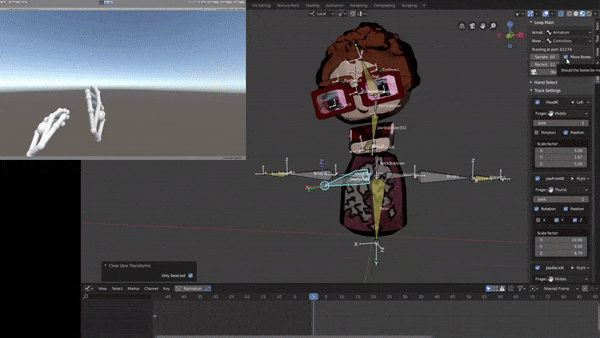
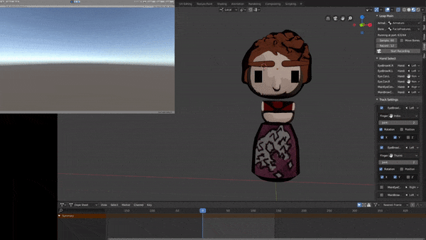

# Leap Motion Bone Poser

This repo consists of a client and server used to  help me animate a character programatically in real time, it can also be adapted and extended to animate any rig using the Pose Bone Groups and Inverse Kinematics.
# Requisites
 To install the Blender Plugin you also need to install the [Websockets](https://websockets.readthedocs.io/en/stable/intro.html) library in your Blender 2.8+ Python environment. 

# Demo

# Record 
Record keyframes to quickly create layered animations

# Rendered Result

